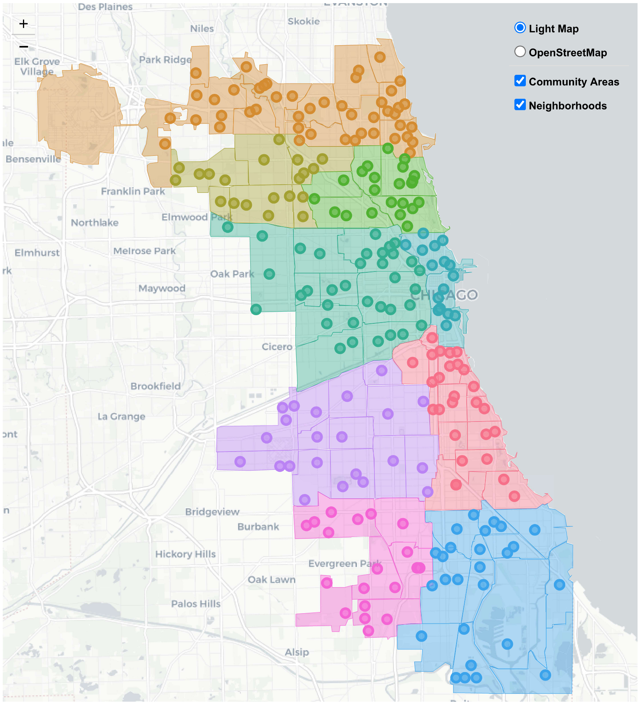
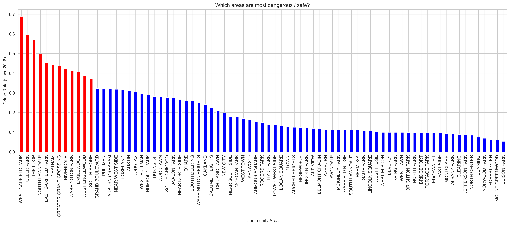
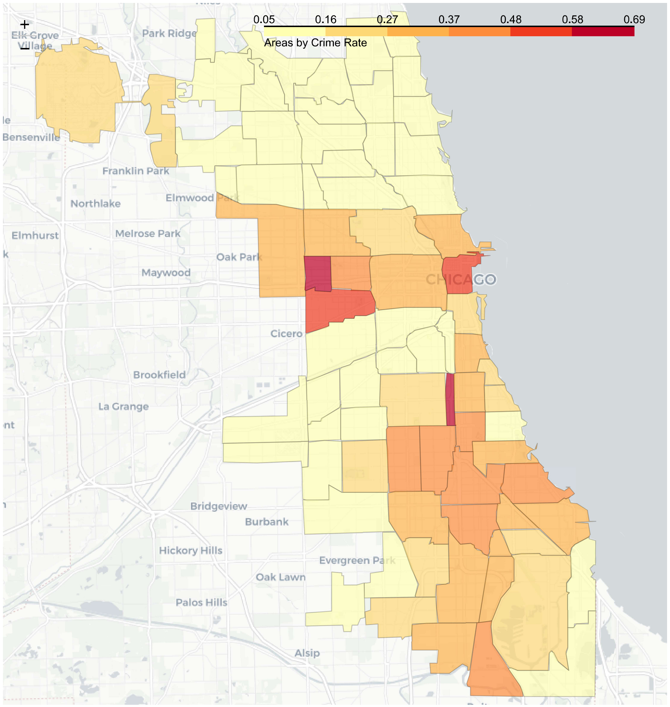
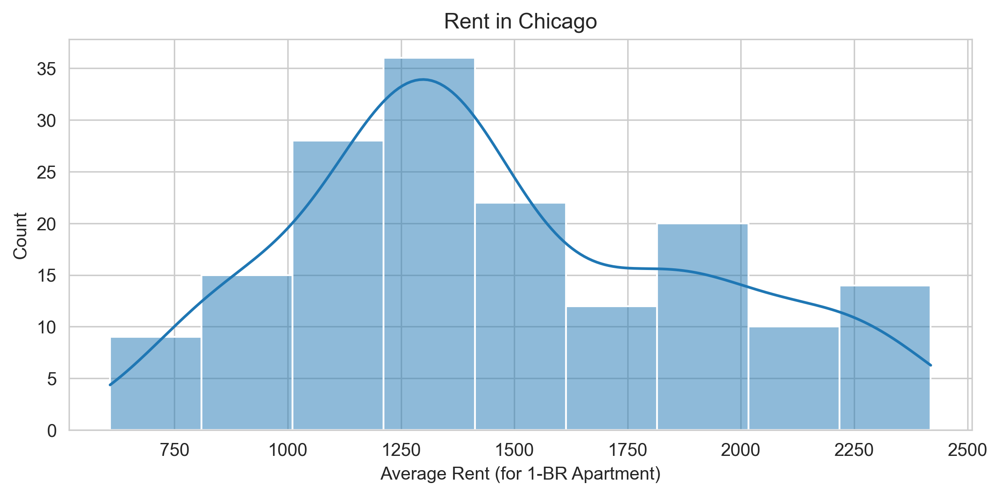
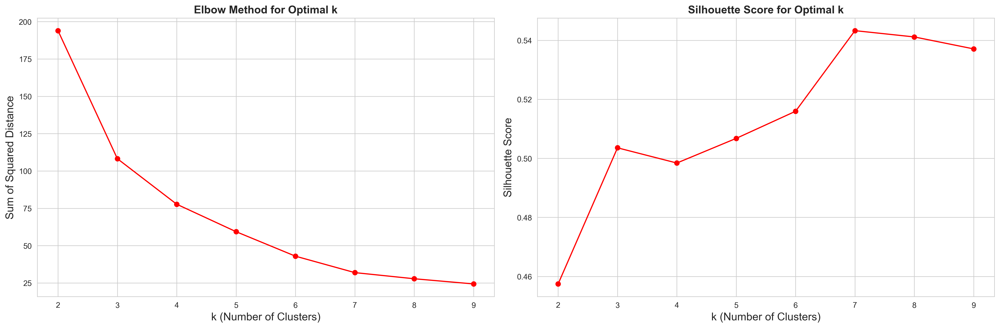
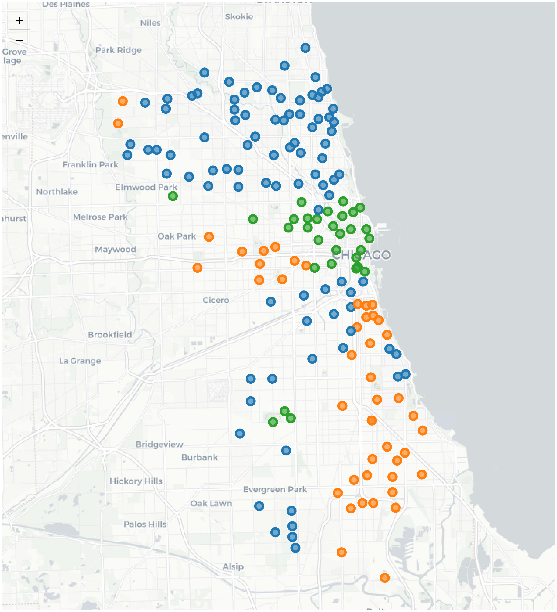
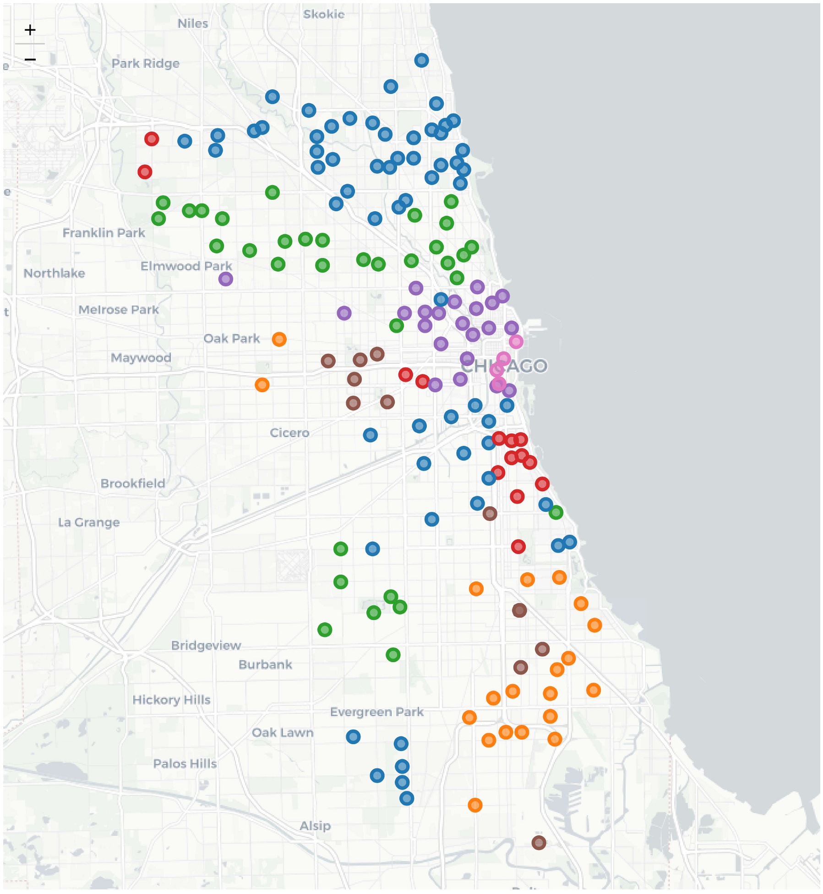

# Exploring Chicago Neighborhoods: Report  

The IBM Data Science Capstone Project "The Battle of Neighborhoods"  

__*by Vadim Belov*__    

# Table of Contents

1. [Introduction and Context](#introduction-and-context)  
2. [Data Sources](#data-sources)  
3. [Methodology and Details of Analysis](#methodology-and-details-of-analysis)  
    - [Understanding Chicago's Geography](#understanding-chicagos-geography)  
    - [Communities Crime Rate Using Chicago Data Portal](#communities-crime-rate-using-chicago-data-portal)  
    - [Neighborhoods Average Rent](#neighborhoods-average-rent)  
    - [Clustering Neighborhoods](#clustering-neighborhoods)  
    - [Types of Venues](#types-of-venues)  
4. [Results and Discussion](#results-and-discussion)  
5. [Conclusion](#conclusion)  

## Introduction and Context  

Finding the right surrounding area to live, that fits your personality and preferences, can often feel like a challenge. It is especially difficult to choose among various locations when moving to a new city that you know little or nothing about. The decision should take into account a variety of factors (such as affordability, available infrastructure, transport, etc.), as well as evaluate possible risks. With so many different options to consider, how can one better weight all the possibilities and make the right choice? 

For this project, I would like to analyze the particular city of interest, using the methods of data science to better understand and compare different neighborhoods. I have chosen to consider the city of Chicago, which is completely unknown to me, so that way I will also be learning a lot in the process (which is the part of fun). I will try to evaluate the city's various regions based on the following three criteria:

1. Which areas are most dangerous / safest?
2. Where the cost of living is more affordable and where it is high?
3. What are the differences and similarities between neighborhoods in terms of local infrastructure (e.g., like food or entertainment venues)?

To answer each question, I am going to leverage open data sources to draw few general conclusions on the relative merits of different areas, that will help to make a better informed decision. Thus, the project is mostly exploratory in nature and, hopefully, can be useful to someone new to Chicago (like me), who plans to visit or even stay there in the future. Finding patterns in the venues among different neighborhoods, in general, can also provide valuable insights about locations to open new business.

## Data Sources 

In accord with the above outline of the scope of planned analysis, I will combine various types of data, acquired from multiple available resources. 

1. First I will gather geographic data on the Chicago's administrative division and area boundaries through Chicago Data Portal (CDP). Information on local neighborhoods and their coordinates can be obtained via webscraping (e.g., Wikipedia) and geocoding API's (e.g., Google or OpenStreetMap), respectively. From the cleaned and processed data I will create an interactive map that will give me a good overview of the city's complicated geography.

2. Chicago Data Portal also provides a very detailed and (almost) up-to-date crime statistics, starting from 2001, gathered by Chicago Police Department. This has to be combined with the population data (also found there), in order to evaluate and compare the crime rate for different areas.

3. The information on rental / house prices is available on multiple real estate resources (either through specialized API, or using the webpage scraping for relevant numbers).

4. Finally, I will use the Foursquare API location data to obtain information on various categories of local venues for each neighborhood (using the collected coordinates).

## Methodology and Details of Analysis  

### Understanding Chicago's Geography  

As a first step, I figure out the territorial divisions of Chicago, that turn out to be quite complicated. This allows me to formulate data requirements precisely, organize different types of data, and conveniently represent them on the map. 

Althogh Chicago is often called "the city of neighborhoods", this type of division is [not official](https://interactive.wttw.com/chicago-by-l/sidetracks/neighborhoods-community-areas-wards-oh-my). Formally, it is made up of *77 community areas* that are often grouped into *9 districts (or "sides")*. The community boundaries are well defined and do not overlap. Each community area has one or more neighborhoods in it. The neighborhoods are often not well defined and overlap each other. According to the [Wikipedia page](https://en.wikipedia.org/wiki/List_of_neighborhoods_in_Chicago):

>There are sometimes said to be more than 200 neighborhoods in Chicago, though residents differ on their names and boundaries.

The bottom line is that the intuitive neighborhoods have much more name recognition, but they have nothing to do with how city governs or tracks data. The latter is usually organized by community areas or City Council wards ([that often fail to reflect the physical reality on the ground](https://chicagodetours.com/chicago-community-areas-explainer/)).

I first visually represent the above divisions on the map, combining both official community areas with informal neighborhoods. To keep it informative and not too congested, different visual means are used for different levels:

1. Choropleth map outlines the community boundaries, and each area is colored with one of 9 sides (boroughs).
2. Neighborhoods will be put on top as clickable pop-up markers.

For this purpose, I create two primary data tables, to where a further information may later be appended. Using GeoPandas, the contents of [community boundaries](https://data.cityofchicago.org/Facilities-Geographic-Boundaries/Boundaries-Community-Areas-current-/cauq-8yn6) geojson file from CDP can be read directly into dataframe with spatial data. Every row represents one community area, and the last column contains the polygon, representing shape of the regional borders:

|    | area_number     | community        | geometry                                              |
|---:|----------------:|:-----------------|:------------------------------------------------------|
|  0 | 35              | DOUGLAS          | MULTIPOLYGON (((-87.60914 41.84469, -87.60915 ...     |
|  1 | 36              | OAKLAND          | MULTIPOLYGON (((-87.59215 41.81693, -87.59231 ...     |
|  2 | 37              | FULLER PARK      | MULTIPOLYGON (((-87.62880 41.80189, -87.62879 ...     |
|  3 | 38              | GRAND BOULEVARD  | MULTIPOLYGON (((-87.60671 41.81681, -87.60670 ...     |
|  4 | 39              | KENWOOD          | MULTIPOLYGON (((-87.59215 41.81693, -87.59215 ...     |

To obtain the list of neighborhoods, I am parsing the contents of the above mentioned Wiki via websraping. Apart from the main table that classify neighborhoods by community areas, the two others tell us which of the 9 sides does the community belong to, and also whether the neighborhood is recognized by the City of Chicago ("recognized"), or is one of the other districts and areas recognized by the community ("unofficial"). I include this information as well. 

Finally, I fetch the coordinates of each neighborhood by its name, using the combination of results from 2 geocoding APIs (Google and Nominatim) to obtain the most exhaustive and accurate catalogue of locations. After data wrangling and follow-up cleaning, such that the two tables are compatible (by the community name), the second dataframe looks as follows (with total of 233 neighborhoods):

|    | Neighborhood    | Community area   | Side          | Status     |   Latitude |   Longitude |
|---:|:----------------|:-----------------|:--------------|:-----------|-----------:|------------:|
|  0 | Albany Park     | Albany Park      | Far North     | recognized |    41.9683 |    -87.728  |
|  1 | Altgeld Gardens | Riverdale        | Far Southeast | unofficial |    41.6542 |    -87.5997 |
|  2 | Andersonville   | Edgewater        | Far North     | recognized |    41.9817 |    -87.6685 |
|  3 | Archer Heights  | Archer Heights   | Southwest     | recognized |    41.8079 |    -87.7236 |
|  4 | Armour Square   | Armour Square    | South         | unofficial |    41.8408 |    -87.634  |

With the obtained data, I then create an interactive overview map of Chicago, using the Folium library. This map is used to quickly look up the neighborhoods and community areas.

### Communities Crime Rate Using Chicago Data Portal  

To start exploring the city, it might be a good idea to understand the criminal situation in its various regions. Having this information can provide suggestions for which regions are most safe, and which are better to avoid, both whether you are tourist or planning to move. 

CDP provides a very detailed and (almost) up-to-date [crime statistics](https://data.cityofchicago.org/Public-Safety/Crimes-2001-to-Present/ijzp-q8t2), starting from 2001. As a first rough approximation, I retrieve overall number of crimes (over last two years for a good average), grouped by community areas. Since the full dataset is too large to download, I access the database through the SODA API, that uses the specialized "SoQL" query language. With the simple SQL-like request, the following list of total crime numbers is returned (restricted > 2018):

| area_number  |   9 |   47 |   74 |   12 |   55 |
|:-------------|----:|-----:|-----:|-----:|-----:|
| total_crimes | 595 |  818 | 1132 | 1145 | 1163 |

The overall frequency counts by area depends on the area size and population, and therefore is not very representative. A better approach would be to combine it with the [population data](https://data.cityofchicago.org/Facilities-Geographic-Boundaries/Population-by-2010-Census-Block/5yjb-v3mj), which is available by small census blocks, organized into larger census tracts. To aggregate the required values by community areas, I have to use [tract boundaries](https://data.cityofchicago.org/Facilities-Geographic-Boundaries/Boundaries-Census-Tracts-2010/5jrd-6zik) to get a corresponding area number for each tract. Having done this, I obtain the following crime statistics and plot the results:

|   area_number |   total_crimes |   total_population |   crime_rate |
|--------------:|---------------:|-------------------:|-------------:|
|             9 |            595 |              11187 |    0.0531867 |
|            47 |            818 |               2916 |    0.280521  |
|            74 |           1132 |              19093 |    0.0592887 |
|            12 |           1145 |              18508 |    0.0618651 |
|            55 |           1163 |               9426 |    0.123382  |

I also put the crime rate on the map in order to see the spatial distribution by community areas.

### Neighborhoods Average Rent

Another important factor for someone who may plan to stay in Chicago for a longer period is the cost of living. In particular, how expensive is it to buy or rent an appartment in various parts of Chicago? Having in mind primarily a newcomer to the city, I am not considering housing prices, but instead focus on ranking various locations by typical rent. 

I found the relevant information on average rent by neighborhood on [RENTCafe](https://www.rentcafe.com/average-rent-market-trends/us/il/chicago/), which seems to be relatively up-to-date. After scraping the webpage, correcting some of the neighborhood names and formatting the values, one can easily see see top 5 neighborhoods the with both highest, or lowest rent (from those 166 with available data):

|   Average Rent | Neighborhood                     | Community area                      | Side          | Status     |   Latitude |   Longitude |
|---------------:|:---------------------------------|:------------------------------------|:--------------|:-----------|-----------:|------------:|
|            608 | The Island                       | Austin                              | West          | unofficial |    41.8671 |    -87.7702 |
|            728 | South Austin                     | Austin                              | West          | unclear    |    41.8873 |    -87.7603 |
|            782 | Avalon Park                      | Avalon Park                         | Far Southeast | recognized |    41.7442 |    -87.5856 |
|            782 | Calumet Heights                  | Calumet Heights                     | Far Southeast | recognized |    41.7298 |    -87.5705 |
|            782 | East Chatham                     | Chatham                             | Far Southeast | unclear    |    41.7481 |    -87.6014 |
|            ... | ...                              | ...                                 | ...           | ...        |        ... |         ... |
|           2308 | River North                      | Near North Side                     | Central       | recognized |    41.8924 |    -87.6341 |
|           2316 | New Eastside                     | The Loop                            | Central       | unclear    |    41.8862 |    -87.6174 |
|           2410 | Streeterville                    | Near North Side                     | Central       | recognized |    41.8927 |    -87.62   |
|           2419 | Dearborn Park                    | Near South Side                     | Central       | unclear    |    41.8664 |    -87.629  |
|           2419 | Printer's Row                    | The Loop                            | Central       | recognized |    41.8738 |    -87.6289 |

The rent prices are distributed as follows:

### Clustering Neighborhoods  

In principle, we could manually cut the rent prices into bins, in order to categorize neighborhoods into selceted price ranges. Instead, let's combine rent and crime data and see if we can identify similar groups of neighborhoods, using machine learning techniques. 

I cluster the neighborhoods, based on crime and rent statistics, using the simple k-Means algorithm. Before training the model, one has to first normalize the data and specify the number of cluster. I perform the grid search and analyze the accuracy scores:

Silhouette score varies from -1 to 1. A score value of 1 means the cluster is dense and well-separated from other clusters. A value near 0 represents overlapping clusters, data points are close to the decision boundary of neighboring clusters. A negative score indicates that the samples might have been assigned into the wrong clusters.

The "elbow" on the left graph can be seen to be roughly at `k=3` but is not very pronounced. From the plot on the right, there is a relative peak in the silhoutte score also at `k=3`. For a more refined clustering, the value of `k=7` also seems to be a nice choice. Running first k-Means with `k=3` gives the following division neighborhoods into clusters on the map:

In order to understand the cluster characteristics, I aggregate the mean values of average rent and crime rate:  

|   cluster |   crime_rate |   Average Rent |  color     |
|----------:|-------------:|---------------:|:-----------|
|         0 |         0.11 |        1437.13 |  blue      |
|         1 |         0.35 |        1076.96 |  orange    |
|         2 |         0.28 |        2166.13 |  green     |

Clustering with `k=7` provides a more detailed picture:

The structure of the clusters can be inferred from the following aggregated statistics as well:

|   cluster |   crime_rate |   Average Rent |  color     |
|----------:|-------------:|---------------:|:-----------|
|         3 |         0.11 |        1275.26 |  blue      |
|         6 |         0.12 |        1791.18 |  green     |
|         2 |         0.24 |        2200.95 |  purple    |
|         1 |         0.3  |        1393.86 |  red       |
|         0 |         0.31 |         875.2  |  orange    |
|         4 |         0.49 |        1043.5  |  brown     |
|         5 |         0.57 |        2251.25 |  lila      |

### Types of Venues  

To gain insights into different types of neighborhoods, one can finally focus on the local infrastructure. Knowing available local facilities can certainly help making the right choice. Also within a given cluster, can we observe any patterns between neighborhoods in terms of local venues?

Using Foursquare API and geographic coordinates, I collect the information on the most popular venues nearby each neighborhood. The fetched data, restricted to the neighborhoods with found clusters (i.e., for which the average rent is known), looks like this:

|   cluster | Neighborhood   | name                 | primary_type   | categories           |     lat |      lng |   nbhd_lat |   nbhd_lng |
|----------:|:---------------|:---------------------|:---------------|:---------------------|--------:|---------:|-----------:|-----------:|
|         3 | Albany Park    | Walgreens            | Shop & Service | Pharmacy             | 41.9685 | -87.7289 |    41.9683 |    -87.728 |
|         3 | Albany Park    | Dollar Tree          | Shop & Service | Discount Store       | 41.9705 | -87.7282 |    41.9683 |    -87.728 |
|         3 | Albany Park    | Lawrence Fish Market | Food           | Seafood Restaurant   | 41.9683 | -87.7263 |    41.9683 |    -87.728 |
|         3 | Albany Park    | McDonald's           | Food           | Fast Food Restaurant | 41.968  | -87.7249 |    41.9683 |    -87.728 |
|         3 | Albany Park    | Petco                | Shop & Service | Pet Store            | 41.9693 | -87.7286 |    41.9683 |    -87.728 |

One can easily see what types of venues are most popular in the cluster's neighborhoods, by taking the mean of the frequency of occurrence of each category. It is possible to see what venue categories are most popular (frequent) within each cluster:

|   cluster | 1st Most Common      | 2nd Most Common    | 3rd Most Common     | 4th Most Common     | 5th Most Common      | 6th Most Common      |
|----------:|:---------------------|:-------------------|:--------------------|:--------------------|:---------------------|:---------------------|
|         0 | Fast Food Restaurant | Park               | American Restaurant | Discount Store      | Sandwich Place       | Pizza Place          |
|         1 | Fast Food Restaurant | Park               | Pizza Place         | Sandwich Place      | Gym / Fitness Center | Baseball Stadium     |
|         2 | Coffee Shop          | Italian Restaurant | Bar                 | Mexican Restaurant  | Pizza Place          | Hotel                |
|         3 | Mexican Restaurant   | Pizza Place        | Chinese Restaurant  | Bus Station         | Bar                  | Coffee Shop          |
|         4 | Fast Food Restaurant | Lounge             | Park                | Fried Chicken Joint | Convenience Store    | Train Station        |
|         5 | Coffee Shop          | Sandwich Place     | Pizza Place         | Hotel               | Park                 | Gym                  |
|         6 | Mexican Restaurant   | Bar                | Pizza Place         | Sandwich Place      | Coffee Shop          | Fast Food Restaurant |

Finally, I am able to rank the venues by popularity for each neighborhood (e.g., within found clusters). Sorting can be done either by individual categories, or primary_type of venues. This should assist in finding the appropriate area to live, according to your taste: 

| Neighborhood      | 1st Most Common    | 2nd Most Common    | 3rd Most Common    | 4th Most Common     | 5th Most Common   | 6th Most Common           |
|:------------------|:-------------------|:-------------------|:-------------------|:--------------------|:------------------|:--------------------------|
| Albany Park       | Pizza Place        | Korean Restaurant  | Mexican Restaurant | Hookah Bar          | Bank              | Sandwich Place            |
| Andersonville     | Bakery             | Coffee Shop        | Italian Restaurant | Café                | Breakfast Spot    | Miscellaneous Shop        |
| Armour Square     | Chinese Restaurant | Italian Restaurant | Grocery Store      | Coffee Shop         | Sandwich Place    | Gas Station               |
| Avalon Park       | Burger Joint       | Boutique           | Pizza Place        | Grocery Store       | Food              | Cajun / Creole Restaurant |
| Back of the Yards | Mexican Restaurant | Pizza Place        | Bank               | Fried Chicken Joint | Laundromat        | Deli / Bodega             |

Running clustering, based on the types of venues, using "one hot encoding" is also possible, but does not lead to any meaningful results in our case.

## Results and Discussion  

Based on available crime and population statistics, I campared different community areas be the calculated crime rate. It seems like the West Garfield Park have been the most crime-prone area, followed by Fuller Park and the Loop. **So I would probably recommend to be cautious visiting those areas found in the top 12!** One can visually recognize the most and least dangerous areas on the Choropleth map.

This is of course only a quick glance of the overall situation, but enough for our purposes. Our estimate is based on an average of all crimes over the span of last couple of years. Many factors can contribute to the crime rate that can give a better picture. For example, we did not distinguish between various categories of crimes. Notice also that the crime rate can greatly vary during the day between various areas. This is a very broad and interesting topic on its own, but here we are just exploring the city areas. 

Combining the crime rate with average rent for 1-BR apartment, and applying the machine learning algorithm (k-Means), the two classification of neighborhoods were obtained. The first division identifies 3 big clusters, based on the above parameters. Cluster 0 is relatively "safe" on the crime scale and is in the medium price range. Clusters 1 and 2 are more crime-prone on average, falling into lower and higher average rents, respectively.

One can notice that lower rent neighborhoods in cluster 1 ("orange") roughly correrspond to areas where the crime rate is high, which is natural. The neighborhoods in the cluster 2 ("green") break this pattern: due to its mostly central location, the rent there is highest (above \$ 2000). I would probably recommend to focus attention on the dominant cluster 0 ("blue") with more affordable rents and safer neighborhoods.

In the second more detailed division, I was able to identify 7 clusters. Here one has 3 categories of criminal index: "low" (clusters 3, 6), "medium" (clusters 2, 1, 0) and "high" (clusters 4, 5). Within each of theses categories, clusters naturally vary in average rent price.

For each neighborhood, the list of most popular types of venues has been found, using Foursquare API. The types of venues has been sorted by frequency of occurence for each neighborhood and for each of 7 identified clusters. This results can help to choose the living area that better suits you preferences. 

Running k-Means clustering, based on types of venues, did not provide any discernible pattern. This is explainable, given that the whole idea of clustering is to identify similar items. In this case, the diversity within types of venues in each neighborhood is very high. One can find a wide variety of items nearby each place, and the obtained classification will often be not very telling. Some additional requirements must be met to further narrow down the search.

## Conclusion  

After performing exploratory and cluster analysis, I have determined the percentages of crime occurred, housing values, and types of venues in the city of Chicago. I have built interactive maps to visualize these analyses to help better determine the ideal neighborhood to move to. 

Through this project I learned more about important stages of data analysis workflow, how to work with open data sources, prepare and clean the data. I also worked through some practical applications of data science methodology, and created some nice-looking visualizations with Folium. I feel rewarded with learning new skills during the course and this project.